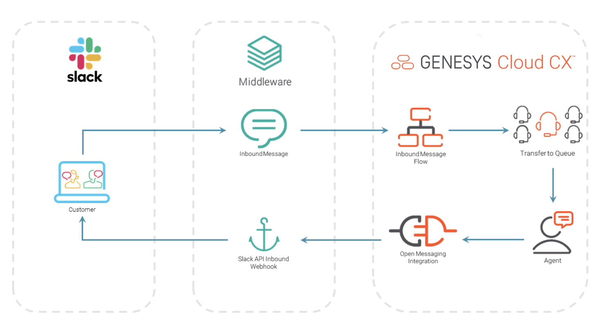
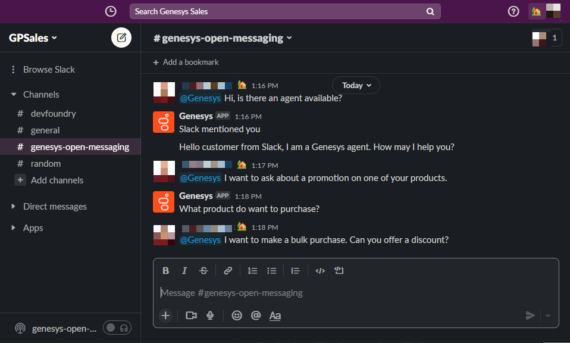
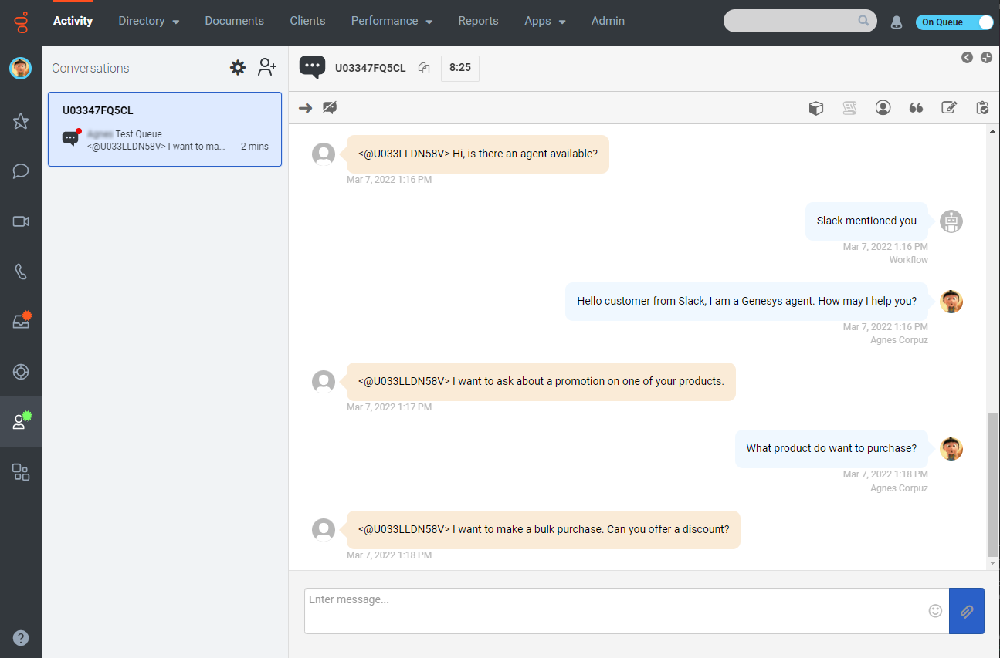
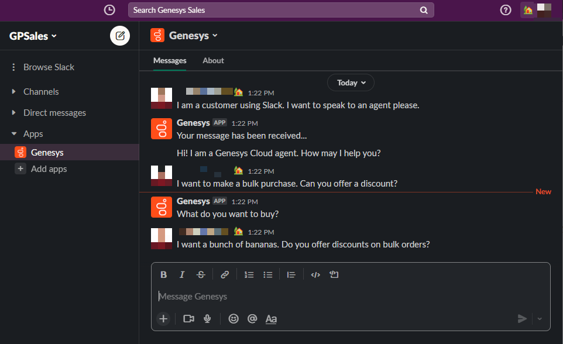

 
This Genesys Cloud Developer Blueprint provides instructions for building a Slack integration using open messaging. This allows customers using Slack have an open message interaction with a Genesys Cloud agent.
 

 
## Solution components
 
* **Genesys Cloud** - A suite of Genesys cloud services for enterprise-grade communications, collaboration, and contact center management. You deploy the Chat Translator solution in Genesys Cloud.
* **Slack Workspace** - A channel-based messaging platform. Slack workspace enables team collaboration and allows tools and services to be connected for better information sharing.
 
### Software development kits (SDKs)
 
* **Genesys Cloud Platform API SDK** - Client libraries used to simplify application integration with Genesys Cloud by handling low-level HTTP requests. We use the Genesys Cloud Platform SDK for the initial chat interaction between the agent and the customer.
 
## Prerequisites
 
### Specialized knowledge
 
- Administrator-level knowledge of Genesys Cloud
- Experience using the Genesys Cloud API Platform
- Experience using the Slack API
 
### Genesys Cloud account
 
* Genesys Cloud license. For more information, see [Genesys Cloud Pricing](https://www.genesys.com/pricing "Opens the Genesys Cloud pricing page") on the Genesys website.
* The Master Admin role in Genesys Cloud. For more information, see [Roles and permissions overview](https://help.mypurecloud.com/?p=24360 "Opens the Roles and permissions overview article") in the Genesys Cloud Resource Center.
 
### Slack account requirements
 
* A user account of type ‘Workspace Owner’.
 
## Implementation steps
 
* [Clone the GitHub repository](#clone-the-github-repository “Goes to the Clone the GitHub repository section")
* [Set up Gensys Cloud](#setting-up-geneys-cloud "Goes to the Setting up Genesys Cloud section")
* [Set up Slack](#setting-up-slack "Goes to the Setting up Slack section")
* [Update common-variables.js](#update-common-variablesjs "Goes to the Update common-variables.js section")
* [Run the middleware](#run-the-middleware "Goes to the Run the middleware section")
* [Test to solution](#test-the-solution "Goes to the Test the solution section")
 
### Clone the GitHub repository
 
1. Clone the [slack-open-messaging-blueprint repository](https://github.com/GenesysCloudBlueprints/slack-open-messaging-blueprint "Opens the slack-open-messaging-blueprint repository in GitHub") to your local machine.
 
### Set up Geneys Cloud
 
#### Create a client credentials OAuth grant
Log in to your Genesys Cloud organization.
Create a new OAuth client that uses the Client Credentials grant type. For more information, see [Create an OAuth client](https://help.mypurecloud.com/articles/?p=188023 "Opens the Create an OAuth client article") in the Genesys Cloud Resource Center.
Copy the Client ID and Client Secret.
On your local blueprint repository, and open the [/docs/common-variables.js](https://github.com/GenesysCloudBlueprints/slack-open-messaging-blueprint/blob/main/docs/common-variables.js) file.
Add the Client ID and Client Secret from your OAuth client against **clientId** and **clientSecret**.
#### Create open messaging platforms
 
Create two open messaging platforms: one for direct messages and the other for app mention. Perform the following steps twice; once for each open messaging platform.
 
1. Log in to your Genesys Cloud organization, navigate to **Admin > Message > Platforms**.
2. Click **Create New Integration** and select **Open Messaging**.
3. Add the following information in the respective fields:
        - Name field - Open Messaging Direct Message (For direct messages open messaging platform)
                       Open Messaging App Mention (For app mention open messaging platform)           
        - Outbound Notification Webhook URL field - URL of the hosted site. To test the integration, use https://corpuz-om.loca.lt/slack/openmessaging/slack.
        - Outbound Notification Webhook Signature Secret Token field - Enter a value and make a note of the value.
4. On your local blueprint repository, and open the [/docs/common-variables.js](https://github.com/GenesysCloudBlueprints/slack-open-messaging-blueprint/blob/main/docs/common-variables.js) file.
5. Add the Outbound Notification Webhook Signature Secret Token value against `open_messaging_secret_token'.
 

 
#### Create inbound message flow
 
Create two inbound message flows: one for direct messages and the other for app mention. Perform the following steps twice; once for each inbound message flow.
 
 
1. Log in to your Genesys Cloud organization, navigate to **Admin > Architect**.
2. Choose **Inbound message flow**, and click **+ Add**.
3. In the **Name** field, enter **Slack Direct Message** (for direct message inbound message flow) or **Slack App Mention** (for app mention inbound message flow).
4. Enter the division name in the **Division** field. Click **Create Flow**.
3. Optionally, you can send a standard response to the customer before the message is transferred to the queue. Use the **Send Response** option and enter the preferred message.
4. Use the **Transfer to ACD** option and choose a queue.
5. Click **Save** and **Publish**.
 

 
#### Create Message Routing
 
Create two inbound message flows: one for direct messages and the other for app mention. Perform the following steps twice; once for each inbound message flow.
 
1. Log in to your Genesys Cloud organization, navigate to **Admin > Routing > Message Routing**.
2. Click **+**.
3. In the **Select Flow** field, select the **Slack Direct Message** (for direct message) or **Slack App Mention** (for app mention).
4. In the **Addresses** field, select **Open Messaging Direct Message**.
3. Click **Save**.
 

 
### Setting up Slack
 
#### Enable Incoming Webhooks
 
1. Create a Slack app and choose a Slack workspace to associate your app with. For more information, see [Sending messages using Incoming Webhooks](https://api.slack.com/messaging/webhooks "Opens Sending messages using Incoming Webhooks") in the Slack API documentation.
2. Go to the management dashboard in the Slack app, navigate to **Incoming Webhooks**.
3. Toggle the **Activate Incoming Webhooks**, and then click the **Add New Webhook to Workspace**.
4. Select a channel that the app will post to and click **Authorize**.
   
 
#### Event Subscriptions
 
1. From the management dashboard in the Slack app, navigate to **Event Subscriptions**.
2. Toggle the **Enable Events**.
3. In the **Request URL** field, add the URL of the hosted site. After you add the URL, ensure that **Verified** message appears. To test the integration, use `https://corpuz-om.loca.lt/slack/openmessaging/genesys'.
   
4. Scroll down to **Subscribe to bot events** and click **Add Bot User Event** to add `app_mention` and `message:im'.
   
5. Click **Save Changes**.
 
#### OAuth and Permissions
 
1. From the management dashboard in the Slack app, navigate to **OAuth & Permissions**.
2. Go to **OAuth Tokens for Your Workspace** and copy the value available in the **Bot User OAuth Token** field.
3. On your local blueprint repository, and open the [/docs/common-variables.js](https://github.com/GenesysCloudBlueprints/slack-open-messaging-blueprint/blob/main/docs/common-variables.js) file, and paste this value against `slack_bearer_token`.

4. From the management dashboard, go to **Scopes** and add the following **Bot Token Scopes**: `app_mentions:read`, `chat:write`, `im:history`, and `incoming-webhook`. Click **Add an OAuth Scope**.
   
 
#### Enable Bots
 
1. From the management dashboard in the Slack app, navigate to **App Home**.
2. Go to **Show Tabs**, toggle **Message Tab** and check the **Allow users to send Slash commands and messages from the message tab**.
   
 
### Update common-variables.js
Add the values to the following fields:
1. Genesys Cloud OAuth
   - **clientId** - Place your client ID using the Client Credentials grant type.
   - **clientSecret** - Place your client secret using Client Credentials grant type.
2. Open Messaging
   - **open_messaging_secret_token** - The value of **Outbound Notification Webhook Signature Secret Token** when the Open Messaging Platform was configured.
   - **open_messaging_direct_messaging_id** - Run GET /api/v2/conversations/messaging/integrations/open and add the ID of **Open Messaging Direct Message**.
   - **open_messaging_app_mention_id** - Run GET /api/v2/conversations/messaging/integrations/open and add the ID of **Open Messaging App Mention**.
3. Slack Configuration
   - **app_verification_token** - From the management dashboard in the Slack app, go to **Basic Information**, go to **App Credentials** and add the value of **Verification Token**.
   - **slack_bearer_token** - From the management dashboard in the Slack app, go to **OAuth & Permissions**, go to **OAuth Tokens for Your Workspace** and add the value of **Bot User OAuth Token**.
   - **slack_app_mention_channel** - Launch Slack and right click to your channel. Select **Open channnel details**. Add the value of **Channel ID** at the bottom of the page.
 
### Run the middleware
 
1. Switch to the directory where the files for your Chat Translator project are located and install the dependencies in the local **node-modules** folder. In the command line, type `npm install`.
2. To run the server locally, in the command line type `node index.js`.
  
:::primary
**Note**: For this project, the default port is 12000 and host is 0.0.0.0. However, you can use a different port and host by updating the config.js file.
:::
 
### Test the solution
 
#### Slack App Mention
 
1. As a Genesys Cloud agent user, make sure you are **On Queue** to receive incoming interactions.
2. Go to Slack and mention your Slack app.
3. On the Slack app, you should receive the message configured on the **Architect Inbound Message** flow.
4. On Genesys Cloud, the agent should be able to receive the message from Slack and continue the conversation.
  
  
 
#### Direct Message
 
1. As a Genesys Cloud agent user, make sure you are **On Queue** to receive incoming interactions.
2. Go to Slack and send a message.
3. On the Slack app, you should receive the message configured on the **Architect Inbound Message** flow.
4. On Genesys Cloud, the agent should be able to receive the message from Slack and continue the conversation.
  
  
 
## Additional resources
 
* [Genesys Cloud Platform Client SDK](https://developer.mypurecloud.com/api/rest/client-libraries/ "Opens the Genesys Cloud Platform Client SDK page")
* [Open Messaging](https://developer.genesys.cloud/api/digital/openmessaging/ "Opens the Open messaging page")
* [Sending messages using Incoming Webhooks](https://api.slack.com/messaging/webhooks "Opens Sending messages using Incoming Webhooks")
* [Slack-open-messaging-blueprint repository](https://github.com/GenesysCloudBlueprints/slack-open-messaging-blueprint "Opens the slack-open-messaging-blueprint repository in GitHub")