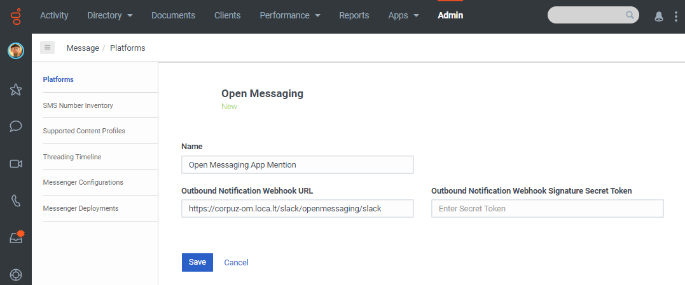
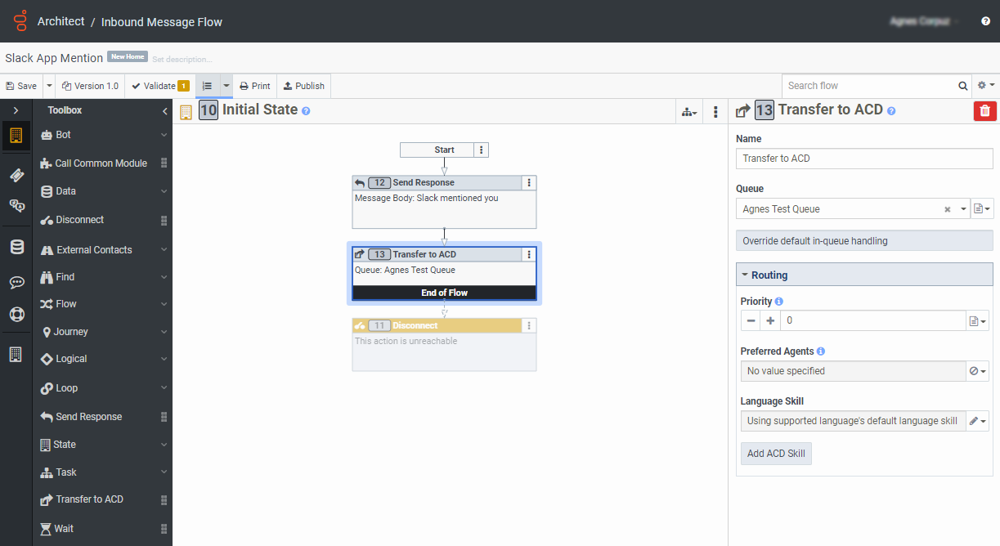
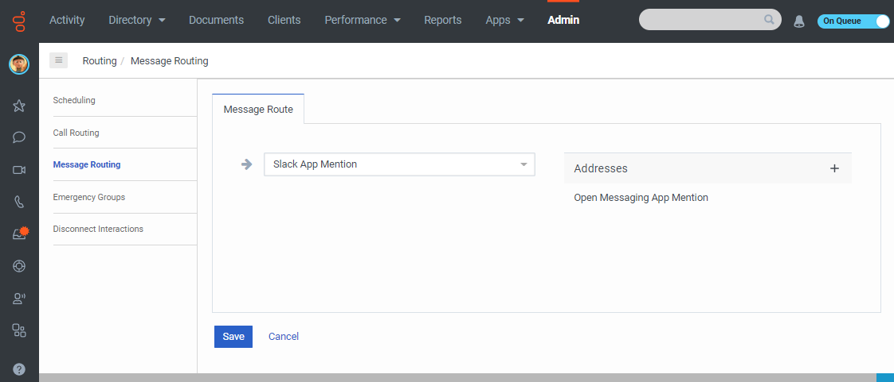
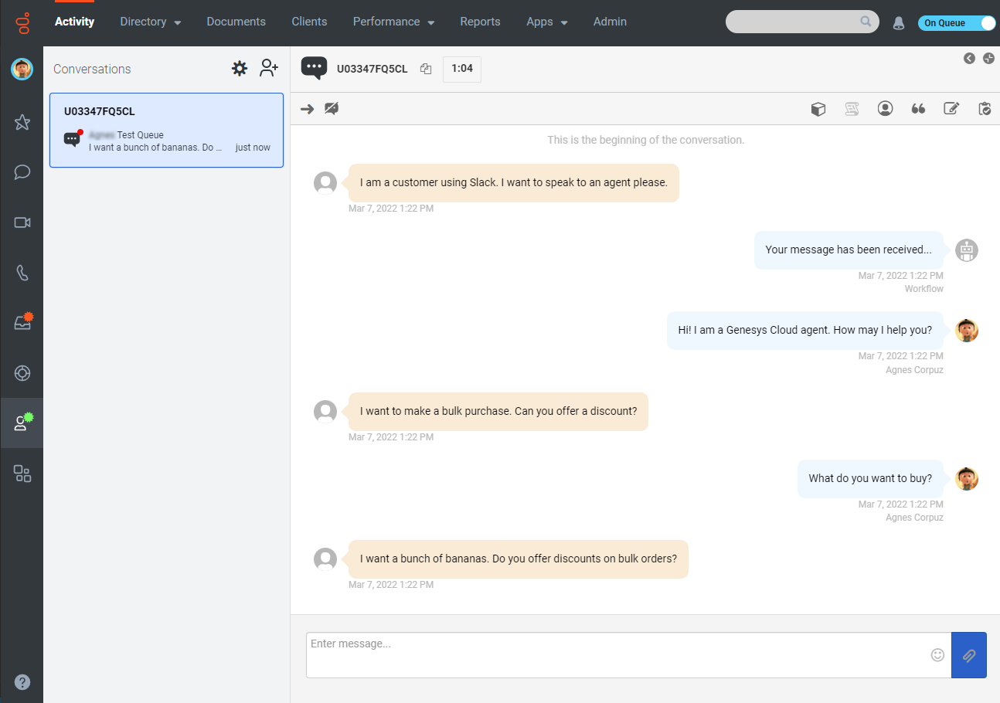

 
This Genesys Cloud Developer Blueprint provides instructions for building a Slack integration that uses open messaging. This integration allows agents to communicate with customers via Slack.
 

 
## Solution components
 
* **Genesys Cloud** - A suite of Genesys cloud services for enterprise-grade communications, collaboration, and contact center management. In this solution, the Genesys Cloud open message feature allows you to integrate with Slack.
* **Slack Workspace** - A channel-based messaging platform. Slack Workspace enables team collaboration and allows tools and services to be connected for better information sharing.
 
### Software development kits (SDKs)
  
* **Genesys Cloud Platform API SDK** - Client libraries used to simplify application integration with Genesys Cloud by handling low-level HTTP requests. We use the Genesys Cloud Platform SDK for the initial chat interaction between the agent and the customer.
 

 
## Prerequisites
 
### Specialized knowledge
 
- Administrator-level knowledge of Genesys Cloud
- Experience using the Genesys Cloud API Platform
- Experience using the Slack API
 
### Genesys Cloud account
 
* Genesys Cloud license. For more information, see [Genesys Cloud Pricing](https://www.genesys.com/pricing "Opens the Genesys Cloud pricing page") on the Genesys website.
* The Master Admin role in Genesys Cloud. For more information, see [Roles and permissions overview](https://help.mypurecloud.com/?p=24360 "Opens the Roles and permissions overview article") in the Genesys Cloud Resource Center.
 
### Slack account requirements
 
* A user account of type Workspace Owner
 
## Implementation steps
 
### Clone the GitHub repository
 
1. Clone the [slack-open-messaging-blueprint repository](https://github.com/GenesysCloudBlueprints/slack-open-messaging-blueprint "Opens the slack-open-messaging-blueprint repository in GitHub") to your local machine.
 
### Set up Geneys Cloud
 
#### Create an OAuth client with a client credentials grant

1. Log in to your Genesys Cloud organization.
2. Create an OAuth client that uses the Client Credentials grant type. For more information, see [Create an OAuth client](https://help.mypurecloud.com/articles/?p=188023 "Opens the Create an OAuth client article") in the Genesys Cloud Resource Center.
3. Copy the Client ID and Client Secret.
4. In your local blueprint repository, open the [/docs/common-variables.js](https://github.com/GenesysCloudBlueprints/slack-open-messaging-blueprint/blob/main/docs/common-variables.js) file.
5. For the `clientId` and `clientSecret`, specify the Client ID and Client Secret from your OAuth client.

#### Create two open messaging integrations
 
Repeat the following steps to create two open messaging integrations: one for direct messages and the other for app_mention events.  

1. In your Genesys Cloud organization, navigate to **Admin** > **Message** > **Platforms**.
2. Click **Create New Integration** and then click **Open Messaging**.
3. Specify the following values:  
   * **Name**: One of the following, depending on the type of integration:
      ** Open Messaging Direct Message (For direct messages open messaging platform)
      ** Open Messaging App Mention (For app mention open messaging platform)           
   * **Outbound Notification Webhook URL**: URL of the hosted site
   * **Outbound Notification Webhook Signature Secret Token**: Any value. Make a note of the value.
4. In your local blueprint repository, open the [/docs/common-variables.js](https://github.com/GenesysCloudBlueprints/slack-open-messaging-blueprint/blob/main/docs/common-variables.js) file.
5. For the `open_messaging_secret_token`, specify the Outbound Notification Webhook Signature Secret Token value.
6. (Optional) To test the integration, use https://corpuz-om.loca.lt/slack/openmessaging/slack.
 
For more information, see [Configure an open messaging integration](https://help.mypurecloud.com/?p=242772 Goes to the Configure an open messaging integration article) in the Genesys Cloud Resource Center.

#### Create two Architect inbound message flows
 
Repeat the following steps to create two Architect inbound message flows: one for direct messages and the other for app_mention events.  

1. In your Genesys Cloud organization, navigate to **Admin** > **Architect**.
2. Click **Inbound message flow**, and click **+ Add**.
3. Specify the following values: 
  * **Name**: One of the following, depending on the type of integration:
   ** `Slack Direct Message` (for direct message inbound message flow) 
   ** `Slack App Mention` (for app_mention events inbound message flow)
 * **Division**: Your division name 
4. Click **Create Flow**.
5. Optionally, send a standard response to the customer before the message is transferred to the queue. To do this, use the **Send Response** option and enter your preferred message.
7. Click the **Transfer to ACD** option and choose a queue.
8. Click **Save** and **Publish**.
  
#### Create two inbound message routing flows
 
Repeat the following steps to create two inbound message routing flows: one for direct messages and the other for app_mention events. 

1. In your Genesys Cloud organization, navigate to **Admin** > **Routing** > **Message Routing**.
2. Click **+**.
3. In the **Select Flow** field, select the **Slack Direct Message** (for direct message) or **Slack App Mention** (for app_mention events).
4. In the **Addresses** field, select **Open Messaging Direct Message**.
3. Click **Save**.
 
### Set up Slack
 
#### Enable incoming webhooks
 
1. Create a Slack app and choose a Slack workspace to associate with your app. For more information, see [Sending messages using Incoming Webhooks](https://api.slack.com/messaging/webhooks "Opens Sending messages using Incoming Webhooks") in the Slack API documentation.
2. Go to the management dashboard in the Slack app, navigate to **Incoming Webhooks**.
3. Toggle the **Activate Incoming Webhooks**, and then click the **Add New Webhook to Workspace**.
4. Select a channel that the app will post to and click **Authorize**.
   
 
#### Configure event subscriptions
 
1. In the Slack app, from the management dashboard, navigate to **Event Subscriptions**.
2. Toggle **Enable Events**.
3. In the **Request URL** field, add the URL of the hosted site. 
4. Ensure that **Verified** message appears. To test the integration, use `https://corpuz-om.loca.lt/slack/openmessaging/genesys`.
   
4. Under **Subscribe to bot events**, click **Add Bot User Event** and add `app_mention` and `message:im'.
   
5. Click **Save Changes**.
 
#### Configure the OAuth token and scope
 
1. In the Slack app, from the management dashboard, navigate to **OAuth & Permissions**.
2. Go to **OAuth Tokens for Your Workspace** and copy the value in the **Bot User OAuth Token** field.
3. In your local blueprint repository open the [/docs/common-variables.js](https://github.com/GenesysCloudBlueprints/slack-open-messaging-blueprint/blob/main/docs/common-variables.js) file, and specify this value for `slack_bearer_token`.

4. From the management dashboard, go to **Scopes** and add the following **Bot Token Scopes**: `app_mentions:read`, `chat:write`, `im:history`, and `incoming-webhook`. 
5. Click **Add an OAuth Scope**.
   
 
#### Enable bots
 
1. In the Slack app, from the management dashboard, navigate to **App Home**.
2. Go to **Show Tabs**, toggle **Message Tab** and select the **Allow users to send Slash commands and messages from the message tab**.
   
 
### Update the common-variables.js file

Add the values to the following fields:
1. Genesys Cloud OAuth
   * **clientId** - The client ID for your OAuth client 
   * **clientSecret** - The client secret for your OAuth client
2. Open Messaging
   * **open_messaging_secret_token** - The value of [**Outbound Notification Webhook Signature Secret Token**](Create two open messaging integrations "Goes to the create_two_open_messaging_integrations section")  
   * **open_messaging_direct_messaging_id** - Run [GET /api/v2/conversations/messaging/integrations/open](https://developer.genesys.cloud/devapps/api-explorer#get-api-v2-conversations-messaging-integrations-open) and add the ID of **Open Messaging Direct Message**.
   * **open_messaging_app_mention_id** - Run [GET /api/v2/conversations/messaging/integrations/open](https://developer.genesys.cloud/devapps/api-explorer#get-api-v2-conversations-messaging-integrations-open) and add the ID of **Open Messaging App Mention**.
3. Slack Configuration
   - **app_verification_token** - From the management dashboard in the Slack app, go to **Basic Information** > **App Credentials** and add the value of **Verification Token**.
   - **slack_bearer_token** - From the management dashboard in the Slack app, go to **OAuth & Permissions** > **OAuth Tokens for Your Workspace** and add the value of **Bot User OAuth Token**.
   - **slack_app_mention_channel** - Launch Slack and right-click your channel. Select **Open channnel details**. At the bottom of the page, add the value of **Channel ID**.
 
### Run the middleware
 
1. Switch to the directory where the files for your project are located and install the dependencies in the local **node-modules** folder. In the command line, type `npm install`.
2. To run the server locally, in the command line type `node index.js`.
  
:::primary
**Note**: For this project, the default port is 12000 and host is 0.0.0.0. However, you can use a different port and host by updating the config.js file.
:::
 
### Test the solution
 
#### Test Slack app_mention events
 
1. Log in to Genesys Cloud as an agent and go **On Queue**.
2. Go to Slack and mention your Slack app.
3. In the Slack app you should receive the message that you configured for the [Architect inbound message flow](#create_two_architect_inbound_message_flows section. Goes to the Create two Architect inbound message flows section)
4. In Genesys Cloud, as an agent, you should receive the message from Slack and continue the conversation.
  
  
 
#### Test a direct message
 
1. Log in to Genesys Cloud as an agent and go **On Queue**.
2. Go to Slack and send a message.
3. On the Slack app, you should receive the message that you configured for the [Architect inbound message flow](#create_two_architect_inbound_message_flows section. Goes to the Create two Architect inbound message flows section).
4. In Genesys Cloud, as an agent, you should be able to receive the message from Slack and continue the conversation.
  
  
 
## Additional resources
 
* [Genesys Cloud Platform Client SDK](https://developer.mypurecloud.com/api/rest/client-libraries/ "Opens the Genesys Cloud Platform Client SDK page")
* [Open messaging](https://developer.genesys.cloud/api/digital/openmessaging/ "Opens the Open messaging page")
* [Sending messages using Incoming Webhooks](https://api.slack.com/messaging/webhooks "Opens Sending messages using Incoming Webhooks") in the Slack documentation
* [Slack API app_mention event](https://api.slack.com/events/app_mention "Opens the app_mention page") in the Slack API documentation
* [Slack-open-messaging-blueprint repository](https://github.com/GenesysCloudBlueprints/slack-open-messaging-blueprint "Opens the slack-open-messaging-blueprint repository in GitHub")
